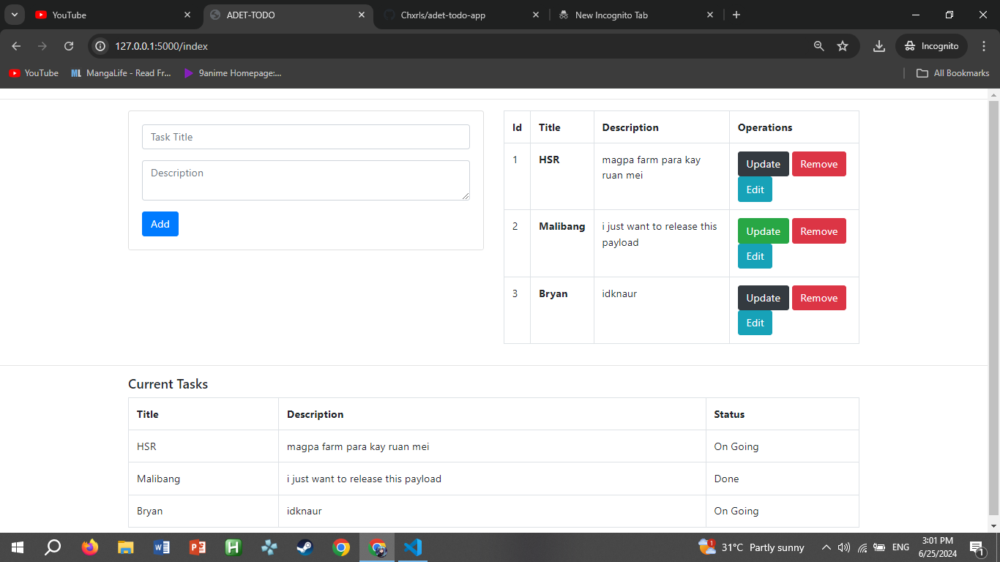

## TODO CRUD APP IN PYTHON FLASK
 
## PROJECT MEMBERS

 1. Charls Melindo
 2. Bryan Antinero
 3. Stephen Cagampang
 4. Kim Orencia

## Sample Screenshot
  
 
 
### Installation for Windows

Clone the project
```
git clone https://github.com/Chxrls/adet-todo-app.git
```
Navigate to the repo
```
cd adet-proj/
```
Intialize the environment
```
python -m venv venv
venv\Script\activate
```
Install the required packages/dependencies
```
pip install -r requirements.txt
```
Run the app
```
flask run
```
